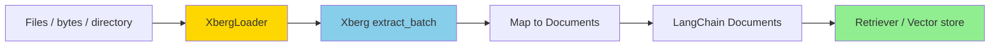

import { Tabs, TabItem } from "@astrojs/starlight/components";

Xberg ships a first-party [LangChain](https://www.langchain.com/) document loader for both Python and
TypeScript. `XbergLoader` turns files, byte buffers, and directories into LangChain `Document` objects
with rich metadata — optionally chunked and ready to embed.

[](https://pypi.org/project/langchain-xberg/)
[](https://www.npmjs.com/package/@xberg-io/langchain-xberg)
[](https://github.com/xberg-io/xberg/blob/main/LICENSE)

- **Python** — [`langchain-xberg`](https://pypi.org/project/langchain-xberg/) on PyPI.
- **TypeScript** — [`@xberg-io/langchain-xberg`](https://www.npmjs.com/package/@xberg-io/langchain-xberg) on npm (for [LangChain.js](https://js.langchain.com)).

## How it works



1. **Resolve** — The loader expands a path, list, or directory glob into a set of inputs.
2. **Extract** — Xberg parses the sources (running OCR where needed). Multiple inputs go through a single batched native call, so concurrency happens Rust-side.
3. **Map** — Each result becomes a `Document`. With chunking enabled you get one `Document` per chunk; with page splitting, one per page; otherwise one per file.
4. **Retrieve** — Hand the Documents to any LangChain text splitter, vector store, or retriever.

## Key capabilities

- **88+ formats** — PDF, DOCX, PPTX, HTML, images, and more, with OCR where needed.
- **Batching** — File lists and directories extract in a single batched native call, not a language-level loop.
- **Chunking** — Enable Xberg's native chunker to emit embedding-sized Documents carrying `chunk_index`, `heading_path`, `page`, and `token_count`.
- **Rich metadata** — `source`, `mime_type`, `title`, `authors`, `detected_languages`, `page_count`, keywords, and tables land in each Document's metadata.

## Installation

<Tabs syncKey="lang">
<TabItem label="Python">

```bash
pip install langchain-xberg
```

Requires Python 3.10+.

</TabItem>
<TabItem label="TypeScript">

`@langchain/core` is a peer dependency — install it alongside the loader:

```bash
npm install @xberg-io/langchain-xberg @langchain/core
```

Requires Node.js 20.15+.

</TabItem>
</Tabs>

## Quick start

<Tabs syncKey="lang">
<TabItem label="Python">

```python
from langchain_xberg import XbergLoader

# Single file
docs = XbergLoader(file_path="report.pdf").load()

# Multiple files — one batched extraction
docs = XbergLoader(file_path=["report.pdf", "notes.docx"]).load()

# A directory with a glob
docs = XbergLoader(file_path="./corpus/", glob="**/*.pdf").load()

# Raw bytes (mime_type required)
docs = XbergLoader(data=raw_bytes, mime_type="application/pdf").load()
```

</TabItem>
<TabItem label="TypeScript">

```ts
import { XbergLoader } from "@xberg-io/langchain-xberg";

// Single file
const docs = await new XbergLoader({ filePath: "report.pdf" }).load();

// Multiple files — one batched extraction
const many = await new XbergLoader({ filePath: ["report.pdf", "notes.docx"] }).load();

// A directory with a glob
const corpus = await new XbergLoader({ filePath: "./corpus/", glob: "**/*.pdf" }).load();

// Raw bytes (mimeType required)
const fromBytes = await new XbergLoader({ data: rawBytes, mimeType: "application/pdf" }).load();
```

</TabItem>
</Tabs>

## Chunking for retrieval

Enable chunking to emit one `Document` per chunk instead of one per file. Each chunk keeps its heading
path and page span, so downstream retrieval preserves document structure.

<Tabs syncKey="lang">
<TabItem label="Python">

```python
from langchain_xberg import XbergLoader
from xberg import ChunkingConfig, ExtractionConfig

config = ExtractionConfig(chunking=ChunkingConfig(max_characters=1000, overlap=200))
docs = XbergLoader(file_path="report.pdf", config=config).load()

print(docs[0].metadata["chunk_index"], docs[0].metadata["heading_path"])
```

To split by page instead, use `pages=PageConfig(extract_pages=True)`; each Document then gets a 0-indexed `page`.

</TabItem>
<TabItem label="TypeScript">

```ts
import { XbergLoader } from "@xberg-io/langchain-xberg";

const loader = new XbergLoader({
  filePath: "report.pdf",
  config: { chunking: { max_chars: 1000, max_overlap: 200 } },
});
const docs = await loader.load();

console.log(docs[0].metadata.chunk_index, docs[0].metadata.heading_path);
```

To split by page instead, use `config: { pages: { extractPages: true } }`; each Document then gets a 0-indexed `page`.

</TabItem>
</Tabs>

## Extraction control

Pass any Xberg `ExtractionConfig` to tune OCR, output format, and batch concurrency.

<Tabs syncKey="lang">
<TabItem label="Python">

```python
from xberg import ExtractionConfig, OcrConfig

config = ExtractionConfig(
    output_format="markdown",
    ocr=OcrConfig(backend="tesseract"),
    force_ocr=True,
    max_concurrent_extractions=8,
)
docs = XbergLoader(file_path="./corpus/", config=config).load()
```

Inside an event loop, use the async API (`aload` / `alazy_load`) — it runs on Xberg's native async
extraction rather than a thread pool.

</TabItem>
<TabItem label="TypeScript">

```ts
const loader = new XbergLoader({
  filePath: "./corpus/",
  config: { outputFormat: "markdown", forceOcr: true, maxConcurrentExtractions: 8 },
});
const docs = await loader.load();
```

`load()` is async and runs on Xberg's native async extraction end to end.

</TabItem>
</Tabs>

For the complete extraction options, see the package READMEs
([Python](https://github.com/xberg-io/xberg/tree/main/integrations/python/langchain),
[TypeScript](https://github.com/xberg-io/xberg/tree/main/integrations/node/langchain-xberg)) and the
[Xberg docs](https://docs.xberg.io).
