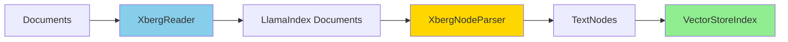

import { Tabs, TabItem } from "@astrojs/starlight/components";

Xberg connects to [LlamaIndex](https://www.llamaindex.ai/) through a reader that turns any of 91+ file
formats into `Document` objects, and a node parser that splits those documents into structure-aware
`TextNode` objects for indexing — available for both Python and TypeScript.

[](https://pypi.org/project/llama-index-readers-xberg/)
[](https://www.npmjs.com/package/@xberg-io/llamaindex-xberg)
[](https://github.com/xberg-io/xberg/blob/main/LICENSE)

- **Python** — [`llama-index-readers-xberg`](https://pypi.org/project/llama-index-readers-xberg/) (`XbergReader`) and [`llama-index-node-parser-xberg`](https://pypi.org/project/llama-index-node-parser-xberg/) (`XbergNodeParser`).
- **TypeScript** — [`@xberg-io/llamaindex-xberg`](https://www.npmjs.com/package/@xberg-io/llamaindex-xberg), exporting both `XbergReader` and `XbergNodeParser` (for [LlamaIndex.TS](https://ts.llamaindex.ai)).

## How it works



1. **Read** — `XbergReader` extracts each source file, mapping title, MIME type, page count, detected languages, keywords, and quality score onto `Document.metadata`. Multiple files go through a single batched call.
2. **Chunk** — With chunking enabled, Xberg's native chunker attaches semantic chunks (heading path, page span) under `_xberg_chunks`.
3. **Parse** — `XbergNodeParser` turns each chunk into a `TextNode` with a source relationship. Without chunks, it falls back to structural elements.
4. **Index** — Feed the nodes into any LlamaIndex index or ingestion pipeline.

## Installation

<Tabs syncKey="lang">
<TabItem label="Python">

```bash
pip install llama-index-readers-xberg llama-index-node-parser-xberg
```

Both require Python 3.10+ and `llama-index-core>=0.14.23,<0.15`. The reader pulls in `xberg`; the node parser has no direct `xberg` dependency.

</TabItem>
<TabItem label="TypeScript">

`@llamaindex/core` is a peer dependency — install it alongside the package:

```bash
npm install @xberg-io/llamaindex-xberg @llamaindex/core
```

Requires Node.js 20.15+.

</TabItem>
</Tabs>

## Reader

Call `loadData` with a path, a list of paths, or raw bytes. Passing a list extracts many files in one
batched call. By default the reader skips files that fail extraction and logs a warning; set
`raiseOnError` (`raise_on_error` in Python) to propagate failures instead.

<Tabs syncKey="lang">
<TabItem label="Python">

```python
from llama_index.readers.xberg import XbergReader

reader = XbergReader()
documents = reader.load_data("report.pdf")

print(documents[0].metadata["file_type"])          # "application/pdf"
print(documents[0].metadata["total_pages"])         # 12
print(documents[0].metadata["detected_languages"])  # ["en"]

# Batch, async, and in-memory bytes
documents = reader.load_data(["report.pdf", "slides.pptx", "data.xlsx"])
documents = await reader.aload_data(["a.pdf", "b.pdf"])
documents = reader.load_data(data=pdf_bytes, mime_type="application/pdf")
```

</TabItem>
<TabItem label="TypeScript">

```ts
import { XbergReader } from "@xberg-io/llamaindex-xberg";

const reader = new XbergReader();
const documents = await reader.loadData("report.pdf");

console.log(documents[0].metadata.file_type); // "application/pdf"
console.log(documents[0].metadata.total_pages); // 12
console.log(documents[0].metadata.detected_languages); // ["en"]

// Batch and in-memory bytes
const many = await reader.loadData(["report.pdf", "slides.pptx", "data.xlsx"]);
const fromBytes = await reader.loadData({ data: pdfBytes, mimeType: "application/pdf" });
```

`loadData` is async and runs on Xberg's native async extraction end to end.

</TabItem>
</Tabs>

## Node parser

`XbergNodeParser` prefers Xberg's native chunks. Enable chunking on the reader, then parse the
documents into nodes. If a document has no chunks, the parser uses structural elements; documents with
neither pass through unchanged with a warning. Each node keeps a `SOURCE` relationship to its parent.

<Tabs syncKey="lang">
<TabItem label="Python">

```python
from xberg import ChunkingConfig, ExtractionConfig
from llama_index.readers.xberg import XbergReader
from llama_index.node_parser.xberg import XbergNodeParser

reader = XbergReader(
    extraction_config=ExtractionConfig(
        chunking=ChunkingConfig(max_characters=1000, overlap=200, prepend_heading_context=True),
    )
)
documents = reader.load_data("report.pdf")

parser = XbergNodeParser()
nodes = parser.get_nodes_from_documents(documents)

print(nodes[0].metadata["chunk_type"])    # e.g. "heading"
print(nodes[0].metadata["heading_path"])  # ["Introduction"]
print(nodes[0].metadata["page_number"])   # 1
```

</TabItem>
<TabItem label="TypeScript">

```ts
import { XbergReader, XbergNodeParser } from "@xberg-io/llamaindex-xberg";

const reader = new XbergReader({
  extractionConfig: { chunking: { max_chars: 1000, max_overlap: 200, prependHeadingContext: true } },
});
const documents = await reader.loadData("report.pdf");

const parser = new XbergNodeParser();
const nodes = parser.getNodesFromDocuments(documents);

console.log(nodes[0].metadata.chunk_type); // e.g. "heading"
console.log(nodes[0].metadata.heading_path); // ["Introduction"]
console.log(nodes[0].metadata.page_number); // 1
```

</TabItem>
</Tabs>

## Full pipeline

<Tabs syncKey="lang">
<TabItem label="Python">

Compose reader and parser into a `VectorStoreIndex` or `IngestionPipeline`:

```python
from llama_index.core import VectorStoreIndex

index = VectorStoreIndex.from_documents(
    documents,
    transformations=[XbergNodeParser()],
)
```

`XbergReader` also works as a `file_extractor` for `SimpleDirectoryReader`:

```python
from llama_index.core import SimpleDirectoryReader

sdr = SimpleDirectoryReader(
    input_dir="./documents",
    file_extractor={".pdf": reader, ".docx": reader, ".html": reader},
)
documents = sdr.load_data()
```

</TabItem>
<TabItem label="TypeScript">

Feed the parsed nodes into any LlamaIndex.TS index:

```ts
import { VectorStoreIndex } from "llamaindex";

const nodes = new XbergNodeParser().getNodesFromDocuments(documents);
const index = await VectorStoreIndex.init({ nodes });
```

</TabItem>
</Tabs>

For the complete options, see the package READMEs
([Python](https://github.com/xberg-io/xberg/tree/main/integrations/python/llama-index),
[TypeScript](https://github.com/xberg-io/xberg/tree/main/integrations/node/llamaindex-xberg)) and the
[Xberg docs](https://docs.xberg.io).
