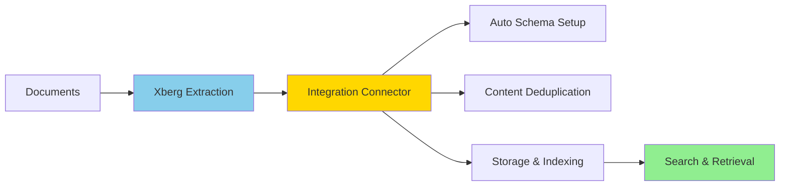

The `surrealdb-xberg` package connects Xberg's document extraction pipeline to [SurrealDB](https://surrealdb.com/). It handles schema creation, content deduplication, optional chunking and embedding, and index configuration.

[](https://pypi.org/project/surrealdb-xberg/)
[](https://pypi.org/project/surrealdb-xberg/)
[](https://github.com/xberg-io/xberg/blob/main/LICENSE)

## How it works



1. **Extract** — Xberg parses the source documents and runs OCR where needed.
2. **Connect** — The connector receives the extracted output and manages the SurrealDB connection.
3. **Store** — Each document is hashed (SHA-256) for deduplication, optionally chunked and embedded, then written to SurrealDB under an auto-generated schema.
4. **Search** — Full-text (BM25), vector (HNSW), and hybrid (RRF) search are available immediately after ingestion.

## Key capabilities

- **Schema management** — `setup_schema()` creates tables, indices, and analyzers. No manual DDL required.
- **Deduplication** — Deterministic record IDs derived from content hashes prevent duplicate rows across ingestion runs.
- **Rich records** — Documents store content, metadata, keywords, named entities (NER), tables, summary, detected languages, and quality score — not just text.
- **Batched extraction** — `ingest_files()` and `ingest_directory()` run a single `extract_batch` call, then batched idempotent inserts.
- **Flexible ingestion** — Single files, file lists, directories (with glob), or raw bytes.
- **Extraction control** — Pass Xberg's `ExtractionConfig` to enable OCR, keywords, NER, summarization, and chunking.
- **Batch tuning** — Adjust `insert_batch_size` to balance throughput against memory usage.

## Installation

```bash
pip install surrealdb-xberg
```

Requires Python 3.10+. You also need a running SurrealDB instance:

```bash
docker run --rm -p 8000:8000 surrealdb/surrealdb:latest start --allow-all --user root --pass root
```

## Quick start

```python
from surrealdb_xberg import DocumentPipeline

pipeline = DocumentPipeline(db=db, embed=True, embedding_model="balanced")
await pipeline.setup_schema()
await pipeline.ingest_directory("./papers", glob="**/*.pdf")
```

## Choosing a class

The package provides two entry points. Choose based on whether you need chunking and embeddings.

|            | `DocumentConnector`                 | `DocumentPipeline`                    | `DocumentPipeline(embed=False)` |
| ---------- | ----------------------------------- | ------------------------------------- | ------------------------------- |
| Stores     | Full documents                      | Documents + chunks                    | Documents + chunks              |
| Embeddings | No                                  | Yes (configurable)                    | No                              |
| Indices    | BM25 on documents                   | BM25 + HNSW on chunks                 | BM25 on chunks                  |
| Best for   | Keyword search over whole documents | Semantic or hybrid search over chunks | Keyword search over chunks      |

For the complete API reference, embedding model options, chunking configuration, and database schema details, see the [surrealdb-xberg readme](https://github.com/xberg-io/xberg/tree/main/integrations/python/surrealdb). For general SurrealDB usage, see the [SurrealDB docs](https://surrealdb.com/docs).
